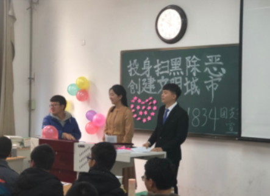
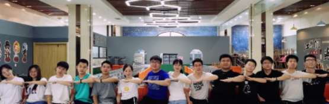

## Hi there 👋

<!--

**Here are some ideas to get you started:**

🙋‍♀️ A short introduction - what is your organization all about?
🌈 Contribution guidelines - how can the community get involved?
👩‍💻 Useful resources - where can the community find your docs? Is there anything else the community should know?
🍿 Fun facts - what does your team eat for breakfast?
🧙 Remember, you can do mighty things with the power of [Markdown](https://docs.github.com/github/writing-on-github/getting-started-with-writing-and-formatting-on-github/basic-writing-and-formatting-syntax)
-->

welcome to this org

这是我：

今年我毕业啦，有幸加入thoughtworks成为其中的一员！

## 我性格开朗，喜欢大家在一起的感觉

这是我参与班级活动和团队聚会的照片：

## 我喜欢爬山、骑行等运动，到没去过的地方看看不一样的可能

- 18年（稻城亚丁）

- 19年（华山）

（在山上看日落）

- 20年（骑行100公里，看黄河）
  在骑行/爬山的过程中，我感觉到自己在专心投入一件事，在挑战中让学会坚持，磨练耐心。我曾经看过一本书，名叫《一个人的朝圣》，里面写道一个老人徒步600多英里，横跨英国去见老友，本来一件困难的事，在老人嘴里说出来，只需要把一只脚放在另一只脚前面，这个故事很大的激励了我。

**这是一个新的开始，期待与大家相遇，一起迎接新的挑战♥**

